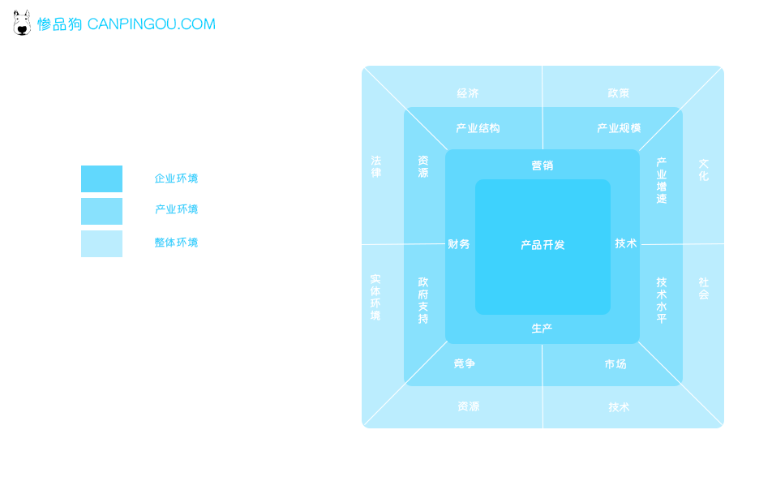
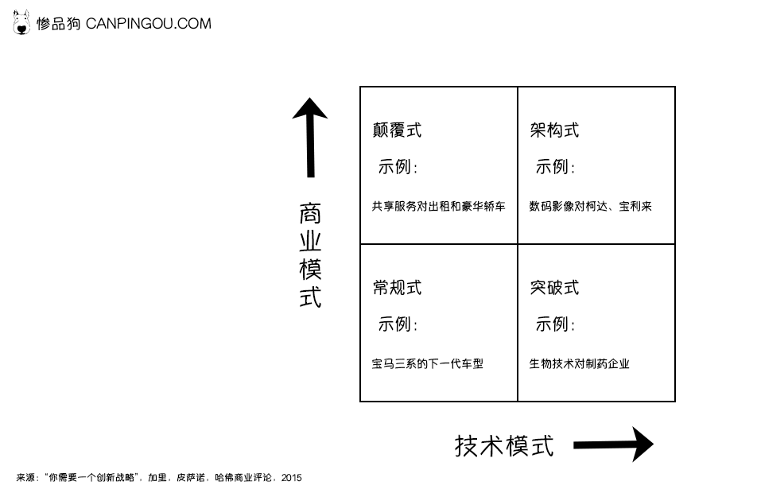

# 战略

## 战略定义

战略是一种方法、计划、规划、说明书。三个目的：
解决问题的路径与方案；
取得优势地位方法；
实现长远目标的规划；

*参考总结：2008年波特、2012年科特勒*

## 战略层级

一个组织应该被整体战略所指导；

> 使命、愿景、价值观
>> 公司战略
>>> 经营战略
>>>> 创新战略
>>>>> 新产品开发组合战略
>>>>>> 新产品开发项目战略

兼顾「其它职能战略」如技术、营销、知识产权战略；

## 组织身份

回答一个问题：我们作为组织，究竟是谁？ *2013维特*

关键特征：
核心的：改变核心，整体性质改变；
持久的：传承，不可触犯；
独特的：标识性，容易区分；

## 愿景

终极目标：成为什么样的公司；
举例：腾讯-最受尊敬的互联网企业；

## 使命

组织的信仰，哲学，精神，信念的陈述；
举例：小米：始终坚持做感动人、价格厚道的产品；

## 价值观

组织坚守的品质和情感；
举例：客户第一、原创、创新、诚实、坚韧……

## 经营战略

选择与决定某产品或服务，为客户提供一份独一无二的价值，从而获取优势地位的增长；

*参考总结 波特1996 特里戈和齐默尔1980*

通过产品开发实践的经营战略步骤：

* 确定定业务目标（聚焦）
* 确定产品开发在以上目标的实现过程中所扮演的角色（贡献）
* 确定产品创新战略的关键基石
* 项目组合筛选和资源分配

以上前提在于明确经营发展目标，了解企业经营状况，企业及业务全球环境等

## 公司战略

大型组织才会有公司战略（一般公司公司战略称为经营战略），大型组织往往分为多个业务单元，每个业务单元聚集一组特定的产品或服务。故而每个业务单元有自己的战略，同时多层级组织有为整个组织服务的整体战略；

故此公司战略是指的：
* 一个多元化组织的整体战略；
* 能够回答“我们应该在哪些业务领域进行竞争？”以及“如何使不同的业务为得以协同，提升整体组织竞争优势”；

  
## 创新战略
 
困难时期，创新战略是进行产品开发和实现持续增长的必要工具 *（库珀和杰特，2009）*

讲明创新如何支撑整体经营战略，有助于取舍，排列优先级，使其所有职能部门协作一致 *（皮萨诺，2015）*

创新战略重要要素：
* 实现公司整体协同一致；
* 明确优先顺序；
* 必须有效取舍权衡；

### 创新战略框架

*以下框架皆无法支撑整体创新战略，但具有启蒙引导作用*

#### 波特战略框架：
* 成本领先战略
* 差异化战略
* 细分市场战略

自我认知波特战略应用方式：
成本领先战略：（供应链）标准化，规模化，（市场）冲量，普适性高，边际成本递减，打开市场缺口

差异化领先战略：如SaaS服务CSM，提高顾客忠诚度，利用差异化获取利润。不过需持续创新（故成本略高），建议精益；

细分市场战略：如《定位》所说，细分出行业第一名，盈利点明显，竞争优势凸显，深耕某个领域，有自己独特的壁垒，就是很容易被降维打击；

#### 迈尔斯和斯诺战略框架：

* 探索：首先上市，寻求增长，敢于冒险；
* 分析：快速跟进，产品通常不错；
* 防御：在稳定市场维护利基市场份额；
* 回应：遭遇威胁后才会作出反应；

自我认知的迈尔斯和斯诺战略框架应用方式：

探索战略：需建立一套类似PMF+MVP体系的测试方法，力求在市场探索阶段提高成功率减少浪费。同时缩短试错实践，快速铺开市场获取份额；

分析战略：对于行业，产业，全球视角有充分及客观认识，并具有一定的市场敏感度，能预见和判断产品核心价值，客户价值，掌握逆向工程和产品改进技能，前期相对于市场份额比探索者少。风险比探索者小；

防御战略：聚焦策略，建立核心壁垒，聚焦的产品类别及技术、体系相当完善，不注重突破性项目；

回应战略：没有目标，没有开发及市场进入计划，被动接受，无法持续增长；

#### 持续式创新和颠覆式创新

 *克里斯坦森首次提出颠覆式创新概念，1997*
 
 目前创新聚集方向有2种，颠覆式和持续式。

 颠覆式：有助于创造一个新的市场和新的价值网络，并会颠覆目前市场和价值网络；

 持续式：对现有市场或价值网络的开发，赋予更高价值，并持续改进，增加市场竞争力；

#### 创新画布

常规式创新：专注于功能改进和新版本或新模型开发；  
颠覆式创新：需要新的商业模式，但不一定需要新技术；  
突破式创新：该类型聚焦于纯技术；  
架构式创新：技术与商业的整合；

## 支撑战略

### 平台战略
平台战略：一系列子系统及其接口，由此建立的一个通用（集合）框架，继而高效开发，制造出其他延伸产品

个人理解：基于一个底层核心技术或产品，在此基础方式建立产品；该战略能增效，方便内外理解核心底层，能区分出自身和市场其他产品，具有差异化；

延伸：中台战略：将原前台的功能平台化，杜绝浪费，重复开发，增加复用性；

### 技术战略

基于经营战略，制定的技术维护和技术发展计划，为组织未来保驾护航；

* 技术预见（流程）：通过如脑爆，专家小组发，德尔菲法，swot法，专利分析法，趋势分析法等预见未来技术趋势及其对组织影响；
* 技术S曲线：揭示技术生命周期，分为引入、成长，成熟；引入期的技术会为组织争取到一个市场领导者的机会，同样风险极大；成长期技术显著提升，技术应用之间竞争激烈；成熟期无法短实现进一步发展，只能是在产品体验、营销、服务等方面提升。成熟期技术面临一个被取代；
* 技术路线图：技术路线图是对产品路线图的补充，确保产品规划与技术规划整体同步一致；

### 营销战略

### 知识产权战略

知识产权：指智力创造出来有形或无形的东西，比如文学，艺术，符号，技术，名称，设计等的所有权；

知识产权类别： 专利、版权、商标、植物品种权、商业秘密；

知识产权的管理方法：

name | 回应 | 主动| 战略| 优化
- | - | - | - | - |
研究与产品开发 | 事后考虑知识产权 | 运营自由度|与公司战略一致|知识产权驱动战略优势——研发投入|
知识产权组合与管理|简单的组合追踪|与业务相关组合，建立知识产权意识|组合管理作为研发与授权的输入|赢得竞争优势进行组合管理|
知识产权并购与货币化|对知识产权授权机会的特别响应|主动识别授权伙伴|知识产权版税和收入目标|业务驱动知识产权货币化与并购mu biao |
竞争情报|特定或者情景驱动的情报收集|关键行业角色收集|持续分析完整的知识产权情报|竞争情报对经营战略而言是关键的|
风险管理与诉讼|回应意外诉讼|外部监控风险|保护知识产权|为高风险投保|

### 能力战略

